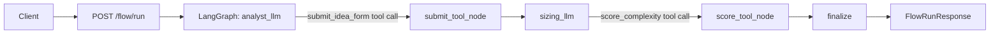

## LLM Orchestration Platform

Production-ready backend scaffold for orchestrating multiple LLM steps with
LangChain + LangGraph. The core flow collects an idea form, runs sizing, and
returns a final answer plus structured metadata.

### Architecture Overview

- FastAPI API layer exposes flow and optional utilities.
- LangGraph state machine drives the orchestration flow.
- LangChain ChatOpenAI/AzureChatOpenAI handle LLM calls.
- Tool registry exposes function tools for LLM tool calls.
- Clear separation of config, orchestration, and tool logic.

### Orchestration Flow (LangGraph)

1) analyst_llm
   - Uses ANALYST_SYSTEM_PROMPT
   - Asks for required idea fields
   - Emits submit_idea_form tool call when complete
2) submit_tool_node
   - Executes submit_idea_form
   - Writes idea_form to state and marks form_submitted = true
3) sizing_llm
   - Uses SIZING_SYSTEM_PROMPT
   - Produces score_complexity tool call
4) score_tool_node
   - Executes score_complexity
   - Writes complexity + analysis_note to state
5) finalize
   - Builds final user-facing answer

### Response Shape

The /flow/run response includes:

- answer: user-facing text
- complexity: T-Shirt size from score_complexity
- isDone: true if submit_idea_form completed
- args: idea_form fields from submit_idea_form
- trace: empty list (reserved for future use)

### API Endpoints

- POST /flow/run
  - Runs the orchestration flow
- POST /rag/query
  - Placeholder RAG endpoint
- POST /functions/list
  - Lists registered tool specs (optional)

### Project Layout

app/
  api/                FastAPI routes
  core/               Settings + DI container
  functions/          Tool registry + tool implementations
  llm_provider/       LLM provider factory + config models
  orchestration/      LangGraph flow + prompts
  models/             Pydantic request/response models
  rag/                RAG placeholder service
  scripts/            CLI helper (optional)

### Environment Configuration

OpenAI:
  LLM_ORCH_DEFAULT_PROVIDER=openai
  LLM_ORCH_OPENAI_API_KEY=sk-...
  LLM_ORCH_OPENAI_BASE_URL=https://api.openai.com/v1
  LLM_ORCH_DEFAULT_OPENAI_MODEL=gpt-4o

Local OpenAI-compatible:
  LLM_ORCH_DEFAULT_PROVIDER=local
  LLM_ORCH_LOCAL_BASE_URL=http://localhost:8000/v1
  LLM_ORCH_LOCAL_API_KEY=dummy
  LLM_ORCH_DEFAULT_LOCAL_MODEL=llama3

Azure OpenAI:
  LLM_ORCH_DEFAULT_PROVIDER=azure
  LLM_ORCH_AZURE_ENDPOINT=https://<resource>.openai.azure.com/
  LLM_ORCH_AZURE_API_VERSION=2024-02-15-preview
  LLM_ORCH_AZURE_DEPLOYMENT_NAME=<deployment-name>
  LLM_ORCH_AZURE_API_KEY=...
  LLM_ORCH_DEFAULT_AZURE_MODEL=gpt-4o

### Run

Start the server:
  python3 -m uvicorn app.main:app --loop asyncio --http h11

Optional CLI:
  python3 -m app.scripts.cli_chat --url http://127.0.0.1:8000

### Diagram

